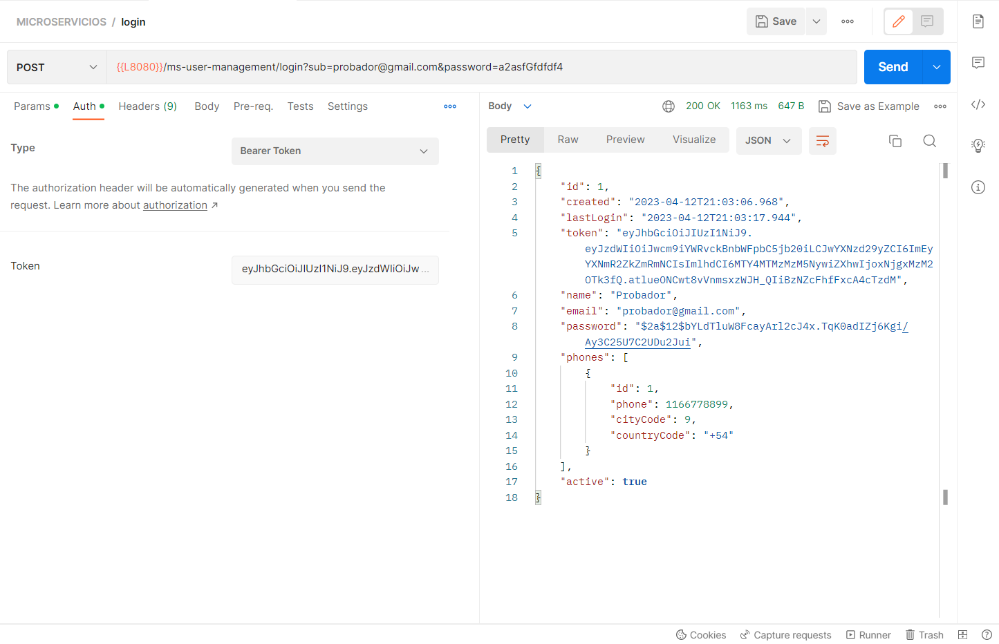

# User management microservice

Microservicio para registro y consulta de usuarios autenticados.


## Stack


## Características utilizadas

### del microservicio

- Registro de nuevos usuarios.
- Generación de JWT token.
- Login de usuarios creados con autenticación.

### nuevas de Java 8

- **Streams**

  Los streams son una forma de recorrer las colecciones distinta a los Iterator.
  La ventaja de los streams es que pueden procesarse de forma serializada o paralela y proporcionan un estilo de operaciones más funcionales.
  Los streams son lazy de modo que las operaciones solo se realizan cuando se llama a la operación final, también son eficientes no necesitando en algunos casos procesar todos los elementos del stream para devolver el resultado final.
  
  Ejemplo:
  


- **Lambda**

  Las expresiones lambda son funciones que no está asociadas a un determinado nombre y que pueden pasarse como argumento a otras funciones.

  Ejemplo:
  


- **Referencias de métodos**

  Con las referencias a métodos podemos usar esos métodos ya implementados como si se tratasen de funciones lambdas.
  Se pueden referenciar métodos estáticos, instancias concretas, instancias de types y constructores.

  Ejemplo:
  

---

## Diagramas UML

Los diagramas se encuentran dentro del proyecto en la carpeta diagrams/

### Diagrama de componentes


### Diagrama de secuencia


---

## Instrucciones de construcción

**Spring Initializr:** A través del portal https://start.spring.io/ se puede iniciar la construcción de una aplicación
introduciendo el nombre del proyecto, sus coordenadas gradle y realizando la selección de las dependencias que conocemos
de antemano que va a necesitar nuestro proyecto. Estas dependencias únicamente nos las agregará al fichero pom.xml por
lo que en caso de no agregarlas en la definición del proyecto podremos agregarlas manualmente con gran facilidad. Para
nuestro primero proyecto el formulario quedará del siguiente modo:


Adicionalmente se agregarán manualmente las siguientes dependencias el el archivo build.gradle:

- Gradle plugin
- Hibernate validator
- Swagger2
- Javax
- JJWT Json Web Token
- Commons validator
- Spock y gmavenplus

  ```
  implementation group: 'org.springframework.boot', name: 'spring-boot-gradle-plugin', version: '3.0.5'
  implementation group: 'org.hibernate.validator', name: 'hibernate-validator', version: '8.0.0.Final'
  implementation group: 'javax.xml.bind', name: 'jaxb-api', version: '2.3.0'
  implementation group: 'io.springfox', name: 'springfox-swagger-ui', version: '3.0.0'
  implementation group: 'io.springfox', name: 'springfox-swagger2', version: '3.0.0'
  implementation group: 'io.jsonwebtoken', name: 'jjwt', version: '0.9.1'
  implementation group: 'commons-validator', name: 'commons-validator', version: '1.7'
  implementation group: 'org.codehaus.gmavenplus', name: 'gmavenplus-plugin', version: '2.1.0'
  testImplementation group: 'org.spockframework', name: 'spock-spring', version: '2.4-M1-groovy-4.0'
  testImplementation group: 'org.spockframework', name: 'spock-core', version: '2.4-M1-groovy-4.0'
  ```

---

## Instrucciones de ejecución

### Run configurations de IntelliJ

Para ejecutar el proyecto primero se deben editar las run configurations en el desplegable superior:


A continuación se edita el comando build indicando en el input las tasks `clean build`.
Luego se edita una segunda configuración con el comando `bootRun` para ejecutar. Ejemplo:


Finalmente se lanza la aplicación:


### Consumo de enpoints via Postman

Se incluyen collections en la carpeta diagrams/postman.

- **sign-up**
  

  

- **login**
  

  

---

## Referencia de API

#### Registro de usuario

```http
  POST /ms-user-management/sign-up
```

| Body       | Tipo     | Descripción                            |
|:-----------|:---------|:---------------------------------------|
| `name`     | `string` | **Opcional**. Nombre de usuario.       |
| `email`    | `string` | **Requerido**. Email del usuario.      |
| `password` | `string` | **Requerido**. Contraseña del usuario. |
| `phones`   | `[]`     | **Opcional**. Teléfonos del usuario.   |

#### Consulta de usuario

```http
  POST /ms-user-management/login
```

| Auth       | Tipo     | Descripción                                                          |
|:-----------|:---------|:---------------------------------------------------------------------|
| `token`    | `string` | **Requerido**. Token que autentica y retrae información del usuario. |
| `sub`      | `string` | **Requerido**. Email del usuario para autenticación.                 |
| `password` | `string` | **Requerido**. Password del usuario para autenticación.                                |

---

## WIP

- Declaraciones de relacionamiento de entidades en hibernate no impacta generación de foreign key en tabla PHONES.
En la captura se puede observar que la declaración fue realizada.

  


- Incorporar conceptos de Spock framework para aplicarlas pruebas unitarias en funcionalidades de capa de servicios.

---
